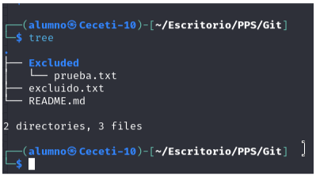

# PPS-Unidad0Actividad4-David 

*Realizado por: David López Castiñeira*

Vamos a hacer una nueva actividad con git. En esta ocasión crearemos un pequeño proyecto de una página web que podremos visualizar creando un pequeño servidor con php. Como en la actividad anterior el producto a realizar será el repositorio en github.

### CONFIGURACIÓN GIT

1. Configura el editor de comandos. Yo por simplicidad utilizaría nano git config — global core.editor nano

2. Vamos también a configurar para que cuando utilicemos git dif o git log se nos muestre todo el mensaje sin entrar en editor. Para ello `git config — global core.pager ' ' .

3. Comprueba qué valor tienen las variables de configuración de git. Puedes utilizar la ayuda git config --help.

4. Ajusta los valores de las variables de Git:

color.status=auto
color.branch=auto
color.interactive=auto
color.diff=auto

### CREACIÓN DE PROYECTO Y REPOSITORIO.

Creamos un nuevo repositorio en GitHub a través del terminal que sea público:

Antes creamos el repositorio en GitHub sin README.md. Nos saldrá lo siguiente:

Hacemos lo primero que nos pide.

Editamos en fichero README.md y le añadimos una descripción del ejercicio.

Comprobamos el resultado.

### IGNORANDO ARCHIVOS.

1. Creamos una carpeta con nombre Excluded. En ella vamos a colocar la documentación que no queremos que sea rastreada y subida al repositorio.

2. Para comprobar que funciona crea algún archivo vacío allí y también crea un archivo con nombre excluido.txt en el directorio principal del repositorio.

3. Crea un archivo con nombre .gitignore en el cual vamos a poner los archivos y directorios que no queremos que se rastreen.

4. Indica en el .gitignore que los archivos con extensión .txt y el directorio Excluded no deben de ser rastreados ni sincronizados.

5. Comprueba el estado del proyecto y comprueba que no nos indica nada del seguimiento de dichos archivos.

Y añadió los cambios y lo subimos al repositorio.

### TRABAJO CON GIT

1. Crea un archivo con nombre index.html.
2. Introduce el código html para que nos muestre un mensaje de Hola mundo con tu nombre. Uno sencillo sería este:
  `<H1>Hola $USER¡¡¡ ¿Qué tal te encuentras?</H1>`

3. Visualiza el estado del proyecto ( puedes hacer también un git status corto git status --s` o `git status --short).

4. Puedes ver como te indica que tienes varias operaciones por hacer: git add, git commit...
5. Añade el archivo index.html al proyecto (git add).

6. Haz un commit (Puedes hacer `commit -am "commentario del commit` de esta manera se añaden las modificaciones de archivos y se hace el commit con el mensaje indicado sin abrir el archivo y tener que escribir nosotros).

7. Vuelve a comprobar el estado del proyecto. Puedes ver como ya debería de estar todo en orden.

8. Vuelve a subir los cambios a tu repositorio de github (git push)

### CREACIÓND DE NUESTRO SERVIDOR WEB Y VISUALIZACIÓN DE NUESTRO PROYECTO

1. En una nueva pestaña de terminal y en el mismo directorio, ejecuta php -S 0:8080 para lanzar un servidor con la página html que has creado.

2. Visualiza la página creada Puedes acceder a ella en tu navegador en el puerto 8080 de tu equipo: 127.0.0.1:8080

### SEGUIMOS TRAAJANDO CON GIT

1. Haz una copia del archivo local index.html con el nombre index.html.save. Modifica el fichero index.html para que cambie el texto mostrado en la página web.

2. Verifica el estado del proyecto.

3. Comprueba las diferencias de los archivos que no han sido añadidos (`git diff`)

(No me sale nada)

4. Refresca el navegador para comprobar que ha cambiado el contenido de nuestra página web.

5. Vuelve a la versión anterior del archivo index.html (`git restore`).

6. Vuelve a refrescar navegador para ver como vuelve a versión inicial.

7. Utiliza el comando git mvpara sobreescribir el archivo index.html con index.html.save

8. Mira el estado del proyecto y confirma todos los cambios.

9. Para pull y push, haz un push y comprueba cómo han subido los archivos a github.com.

10. Modifica el archivo index.php desde la página de github.com y haz un pull y comprueba cómo se ha modificado la página web en nuestro navegador.

### GIT LOG

*Aquí he cambiado la variable core.pager para que funcione bien los ejercicios*

1. Mira la página de (Git Book sobre los comandos git log)[https://git-scm.com/book/es/v2/Fundamentos-de-Git-Ver-el-Historial-de-Confirmaciones]
   
2. Muestra los logs

3. Muestra los logs de los últimos 3 commits

4. Muestra los logs utilizando el modificador ``--pretty`

5. Muestra los logs de los últimos 2 commits donde se vean las diferencias de cada una de las entradas.

6. Muestra los logs de las modificaciones realizadas en el último día

### RAMAS

1. Lista las ramas existentes.

2. Crea una nueva rama con nombre Vers1 a partir de la rama actual.

3. Haz una modificación del index.html y guardas modificaciones.

4. Sube los cambios al respositorio remoto a la rama Vers1 git push origin Vers1 (En este caso podemos ver cómo el index.html de la rama m̀ain y Vers1 son diferentes.

